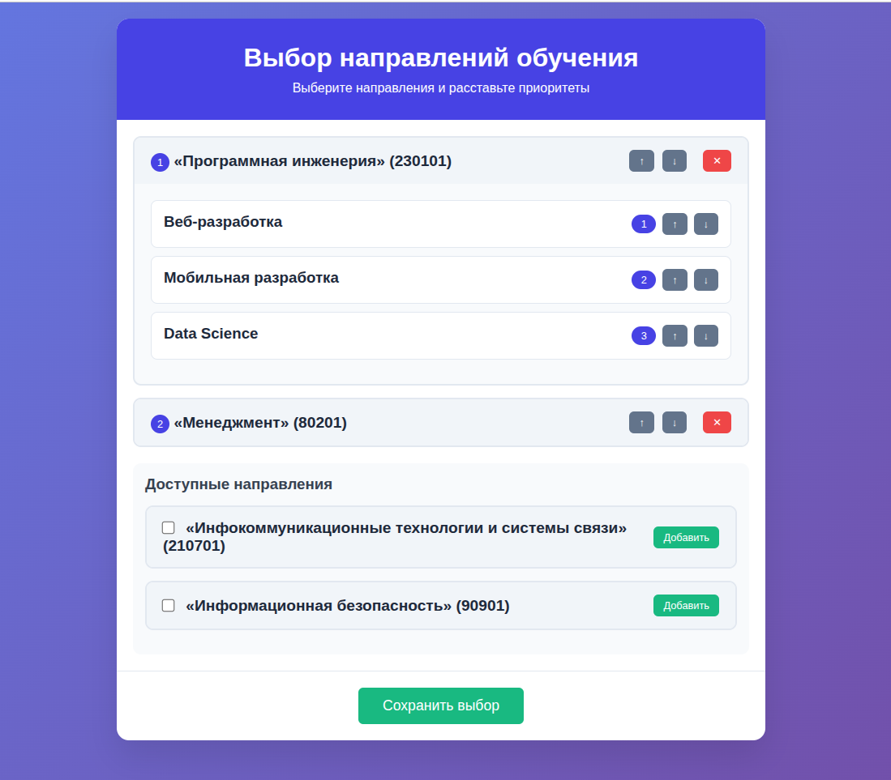

* # 📖 Directions and Profiles Web and API (Laravel 12)

* Web для направлений и профилей 
* REST API для добавления направлений и профилей с указанием их приоритетов 

## Установка и настройка

1. Установите окружение и зависимости:
```bash 
docker-compose build
docker-compose up -d
composer install
```

2. Настройте подключение к базе данных в файле `.env`

3. Выполните миграции:
```bash
php artisan migrate
```

4. Заполните базу тестовыми данными:
```bash
php artisan db:seed
```

## Базовый URL

### Список направлений и профилей
```
http://localhost:8085/directions   
```

## Аутентификация
В текущей версии не требует аутентификации.

### Выбрать направления и профили 
```http
POST http://localhost:8085/api/priorities/save
```

**Тело запроса:**
```json
{
    "directions": [
    {"id": 1,
        "priority": 1,
        "profiles": [{
            "id": 1,
            "priority": 1},
            {"id": 2,
                "priority": 2}
        ]},
    {"id": 2,
        "priority": 2,
        "profiles": [{
            "id": 3,
            "priority": 1},
            {"id": 4,
                "priority": 2},
            {"id": 5,
                "priority": 3}
        ]}
    ]
}
```

## Общий формат ответов

### Успешный ответ:
```json
{
    "success": true,
    "user_id": 1,
    "timestamp": "2025-10-06 13:26:21",
    "summary": {
        "total_directions": 2,
        "total_profiles": 5
    },
    "directions": [
        ...
    ],
    "profiles": [
        ...
    ]
}

```

### Ошибка:
```json
{
    "success": false,
    "message": "Тип ошибки",
    "errors": {
        "directions": [
            "Описание ошибки"
        ]
    }
}
```


